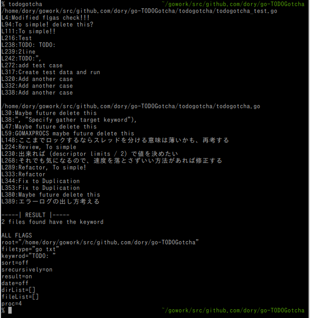
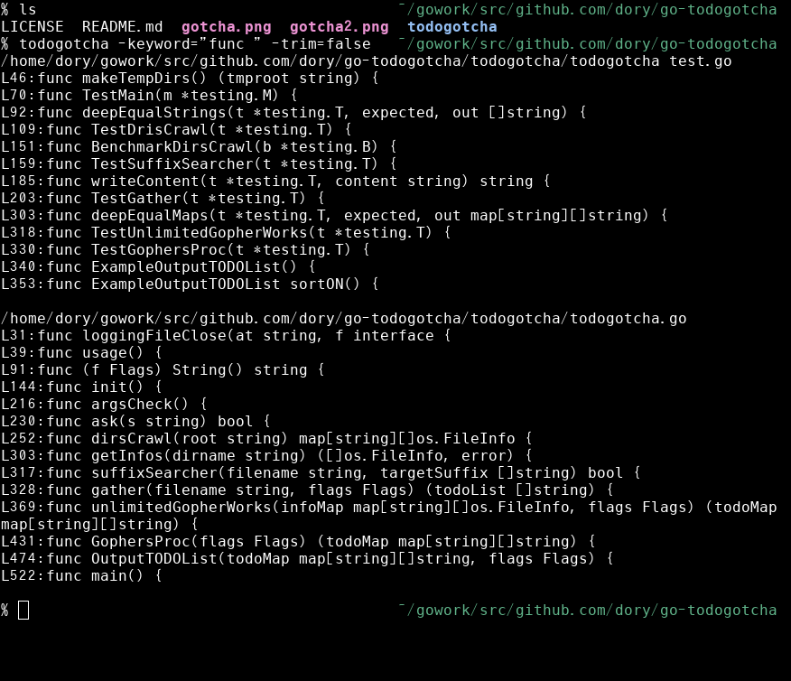

# TODOGotcha
---
ガッチャ!  

Search from current directory recursively  
Create TODO list from search files  
Show the TODO list  

## Example
---
Output from `todogotcha`  
  

If you need make a list from function  
`todogotcha -keyword "func " -trim off -result on`  
  

## Installation
---
```
go get github.com/dorymint/go-TODOGotcha/todogotcha
```

## Usage
---
Display the found TODO list like example
```
todogotcha
```

If you need output to file
```
todogotcha -output "./path/to/file"
```

## Option
---
**Show the flags and default parameter**
```
todogotcha -h
```

| Flags | Description | Default |
| :---- | :---------- | :------ |
| root  | Search root directory | ./ |
| filetype | Target filetypes | "go txt" |
| keyword | Specify target for list | "TODO: " |
| file | Target file list | "" |
| dir | Directory list, is do not recursive search | "" |
| separator | Specify separator for directoris and files | ; |
| output | Output filepath | "" |
| force | Ignore override confirm [on:off]? | off |
| recursively | Recursive search from root [on:off]? | on |
| result | Result for flags state [on:off]? | off |
| sort | Sort for directory name [on:off]? | off |
| date | Add date [on:off]? | off |
| trim | Trim the keyword from output [on:off]? | on |
| line | Specify number of lines for gather | 1 |
| limit | Specify limit of goroutine, for file descriptor | 512 |
| proc | Specify GOMAXPROCS | automatic setting |

**This example is changed default option**
```
todogotcha -root "../../" \
          -keyword "NOTE: " \
          -line 2 \
          -filetype "cpp py txt go" \
          -dir "./path/to/dir1/;../path/to/dir2/" \
          -file "./path/to/file1;../path/to/file2" \
          -date on \
          -proc 2 \
          -result on
```

## Licence
---
MIT
